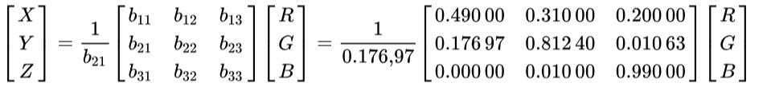
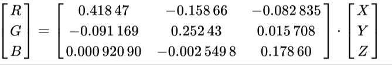

#Q1
##Transform a few more (easy) RGB values manually into corresponding HSI values.

The R,G,B values are divided by 255 to change the range from 0..255 to 0..1:

**R'** = **R/255**

**G'** = **G/255**

**B'** = **B/255**

**Cmax** = **max(R', G', B')**

**Cmin** = **min(R', G', B')**

**Δ = Cmax - Cmin**

- **Hue calculation:**

- **Saturation calculation:**

- **Lightness calculation:**

**L = (Cmax + Cmin) / 2**

*************************

#Q2
##In the CIE’s RGB colour space (which models human colour perception), the scalars R, G, or B may also be negative. Provide a physical interpretation (obviously, we cannot subtract light from a given spectrum).

- The CIE color model is a mapping system that uses tristimulus (a combination of 3 color values that are close to red/green/blue) values, which are plotted on a 3D space. When these values are combined, they can reproduce any color that a human eye can perceive. 

- There is a slight problem however, in order to create an all positive transformation of the RGB CIFs you have to use imaginary primaries that don’t correspond to any real color.

- You can see this in the rg chromaticity diagram, the only way to form a triangle around all of the real colors is to choose primary coordinates outside of the real colors. This is exactly what XYZ does.

- Three new primaries, X Y and Z were picked such that when the RGB data was transformed to have XYZ as the new axes the Y primary mapped to the V curve and all values were positive.

